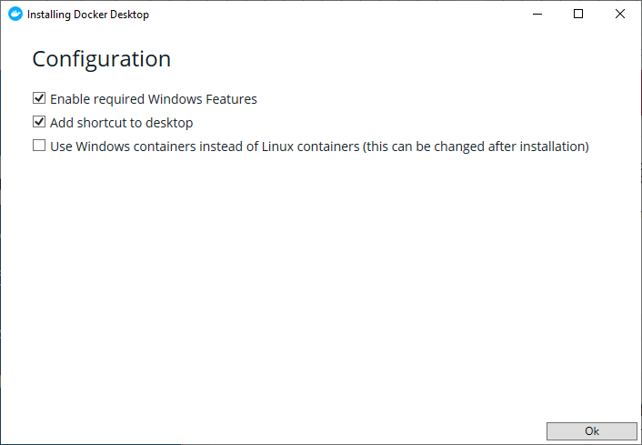

# Docker installatie

Installeer als eerste Docker zelf.

Ga hiervoor naar [https://www.docker.com/]( https://www.docker.com/) en klik op "Get Started"

Selecteer hier voor welk systeem je Docker wilt installeren en klik op "Get Docker"

!!! warning "Windows Versie"
	Als je een  Microsoft Windows 10 Professional of Enterprise 64-bit versie hebt kies je voor [Docker Desktop](#docker-desktop) Anders moet je [Docker Toolbox](#docker-toolbox) installeren.

## Docker Desktop

Als de download klaar is kun je het programma installeren.

Kies in het configuratie scherm voor de standaard opties.

Nadat de installatie klaar is moet de computer opnieuw worden opgestart. 

Mocht je nog documenten open hebben, dan ik het handig deze eerst op te slaan, voordat je de computer opnieuw opstart.

!!! tip ""
	Na het opstarten is Docker klaar voor gebruik.

## Docker Toolbox

De instructies voor Docker Toolbox zijn wat uitgebreider en hebben we niet opgenomen in deze handleiding. Deze uitgebreide engelstalige handleiding kun je vinden op de Docker website.

[https://docs.docker.com/toolbox/overview/](https://docs.docker.com/toolbox/overview/)