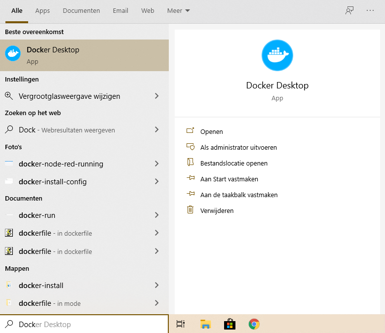
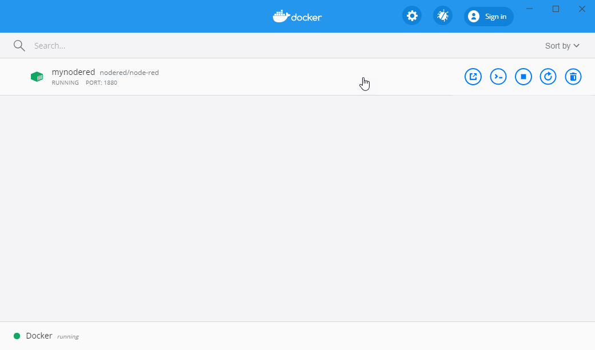

# Docker starten

## Power Shell

Het is aan te bevelen om voor de commando's hieronder de Windows Power Shell te gebruiken. Je start deze als administrator door in het zoekveld van Windows (windows toets en dan beginnen te typen) Power Shell in te typen. Naast het menu krijg je nu de optie om "Power Shell" te starten als administrator. Dit geeft je wat meer rechten waardoor je de installatie commando's mag uitvoeren.


Om een Node-Red server te starten kun je Docker gebruiken is de meest simpele vorm:

Wacht nog even met het uitvoeren dit komt later.

```powershell
docker run -it -p 1880:1880 --name mynodered nodered/node-red
```

Het commando bestaat uit de volgende elementen:

```
docker run              - Het starten van de container. Deze wordt lokaal opgebouwd indien nodig	
-it                     - Koppel een terminal venster zodat we kunnen zien wat ergebeurt.
-p 1880:1880            - Verbind de lokale poort 1880 met de interne poort 1880
--name mynodered        - geef deze machine een lokale vriendelijke naam
nodered/node-red        - het image waarop deze machine gebasseerd is.
```

## Beheer van gebruikers data

Standaard werkt Docker zo, dat als je de container weer stopt, dat deze terugvalt in zijn oorspronkelijke staat. De wijzigingen die je maakt, gaan dus verloren. Dit is heel handig als je wat uit wilt proberen, maar natuurlijk minder handig als je later verder wilt werken. 

Om je wijzigingen op te slaan en deze permanent te maken moet je een opslag locatie koppelen aan je container. Node -Red gebruikt de `/data` directory als opslag voor de gebruikers data zoals de flows die je later aan gaat maken.

### Een data volume aanmaken

Een `named volume` buiten de container zorgt voor permanente oplag. Hierdoor blijft deze data beschikbaar ook nadat de container is gestopt.

Je maakt een nieuw volume door de volgende command's uit te voeren:

```powershell
$ docker volume create --name node_red_user_data
$ docker volume ls
DRIVER              VOLUME NAME
local               node_red_user_data
```

Je start de Node-Red server nu door het volgende commado uit te voeren:

```powershell
$ docker run -it -p 1880:1880 -v node_red_user_data:/data --name mynodered nodered/node-red
```

Na het commando zal het image van Node-Red eerst gedownload worden. Daarna wordt het image opgebouwd zodat het gestart wordt op je machine.

```
Welcome to Node-RED
===================

16 Mar 14:29:17 - [info] Node-RED version: v1.0.4
16 Mar 14:29:17 - [info] Node.js  version: v10.19.0
16 Mar 14:29:17 - [info] Linux 4.19.76-linuxkit x64 LE
16 Mar 14:29:18 - [info] Loading palette nodes
16 Mar 14:29:18 - [info] Settings file  : /data/settings.js
16 Mar 14:29:18 - [info] Context store  : 'default' [module=memory]
16 Mar 14:29:18 - [info] User directory : /data
16 Mar 14:29:18 - [warn] Projects disabled : editorTheme.projects.enabled=false
16 Mar 14:29:18 - [info] Flows file     : /data/flows.json
16 Mar 14:29:18 - [info] Creating new flow file
16 Mar 14:29:18 - [warn]

---------------------------------------------------------------------

Your flow credentials file is encrypted using a system-generated key.

If the system-generated key is lost for any reason, your credentials
file will not be recoverable, you will have to delete it and re-enter
your credentials.

You should set your own key using the 'credentialSecret' option in
your settings file. Node-RED will then re-encrypt your credentials

file using your chosen key the next time you deploy a change.
---------------------------------------------------------------------

16 Mar 14:29:18 - [info] Server now running at http://127.0.0.1:1880/
16 Mar 14:29:18 - [info] Starting flows
16 Mar 14:29:18 - [info] Started flows
```

Zoals je ziet is de Node-Red server gestart. Er draait nu een Linux systeem op je Windows PC en daarbinnen is Node-Red gestart.  Het Power Shell venster moet je open laten staan. Deze is gekoppeld aan de server.
Als je Docker Desktop hebt geinstalleerd volgens de eerdere instructies dan zie je in het dachboard ook de server staan.





De volgende commando's kun je hier aanklikken als je met je muis over de server gaat:

- Openen in de browser
- Open de command line voor deze server
- Stop de server
- Opnieuw opstarten van de server
- Verwijder deze server

Klik op het eerste icoon achter de server naam of ga met je browser nu naar het volgende adres":

http://127.0.0.1:1880/

Hier vindt je de webpagina van Node-Red en deze is momenteel nog geheel blanco.


