# IBM Cloud

Om snel en simpel gebruik te kunnen maken van Node-Red zonder dit op je eigen PC of laptop te moeten installeren, kun je gebruik maken van de Cloud van IBM. Hier is een gratis account aan te maken zodat je snel van start kunt. In deze handleiding leg ik je sap voor stap uit hoe je een account aan maakt en waar je op moet letten. De interface heeft namelijk nogal veel opties en dit kan vrij lastig zijn als je er nog niet eerder mee hebt gewerkt.

## IBM  Cloud Account

We beginnen met een account aanmaken op https://cloud.ibm.com/

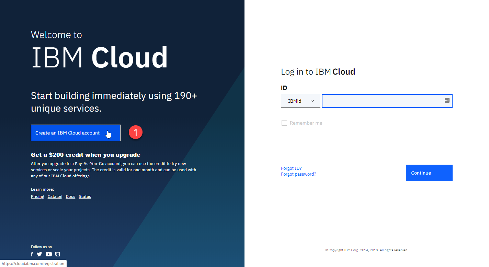

Voer in het volgende scherm je gegevens in en maak een account aan. 

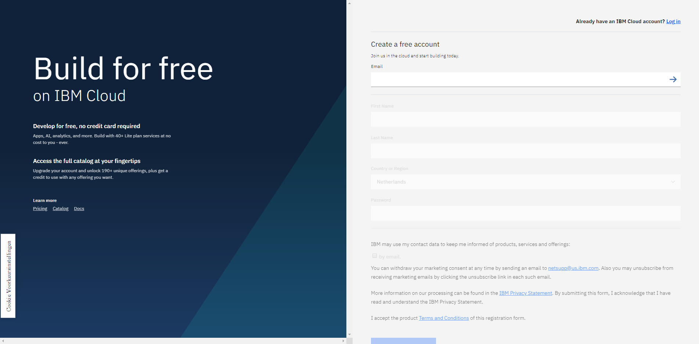

Je krijgt nu een link per email om je account te activeren.

## Node-Red installeren

Als je dit gedaan hebt kun je inloggen en krijg je het volgende scherm:

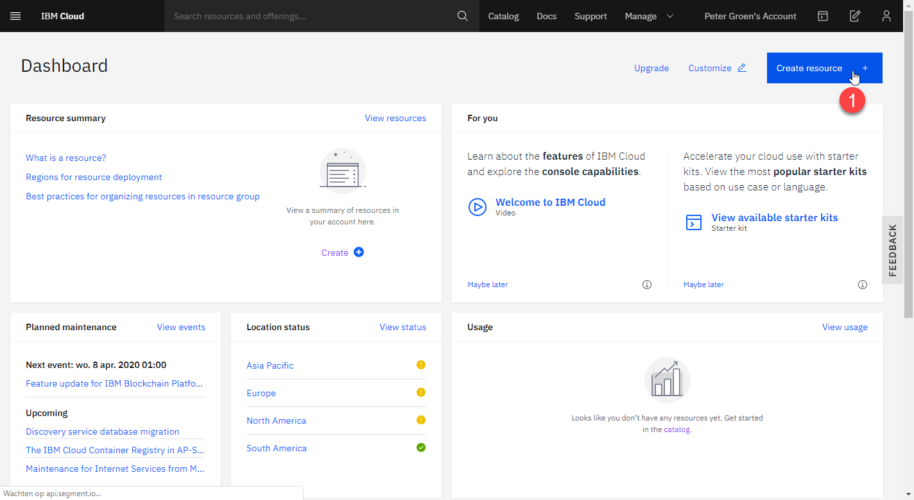

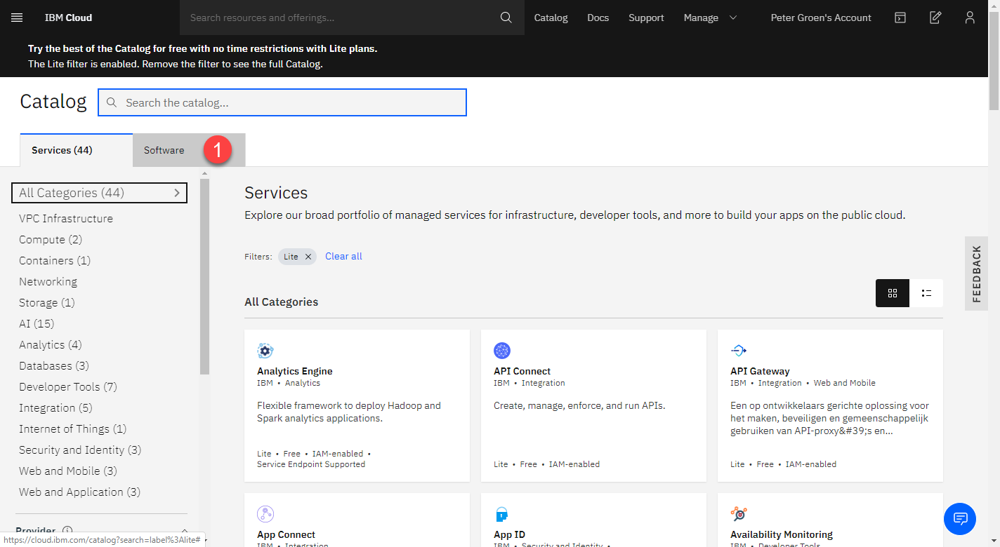

Ga dan naar het tabblad `Software` en zoek in de catalog naar `node-red`

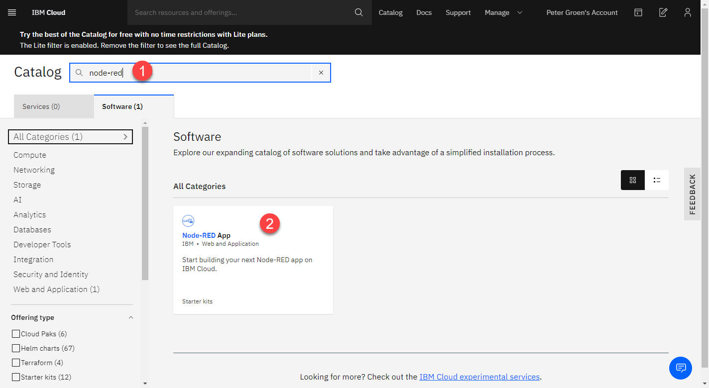

Als je deze selecteert krijg je onderstaand scherm. Klik hier nu op `Create app`

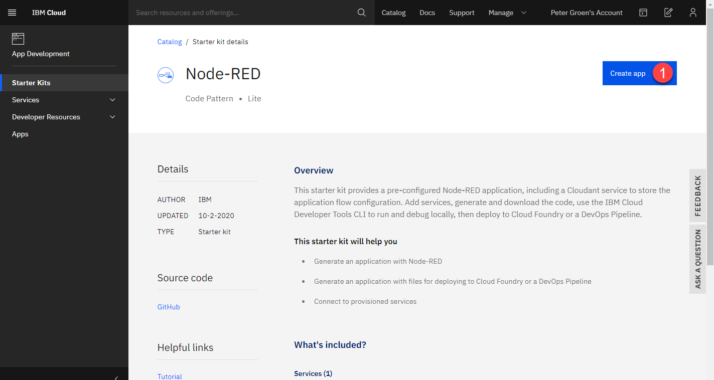

!!! info
	Geef nu een naam op voor de app. Deze naam moet uniek zijn aangezien deze ook wordt gebruikt als onderdeel van de domein naam van de app. Je kunt ook de standaard opgegeven naam gebruiken, dan weet je zeker dat het werkt. Aangezien jij de enige bent die deze app gaat gebruiken is het voor nu ook minder interessant hoe deze app wordt genoemd.

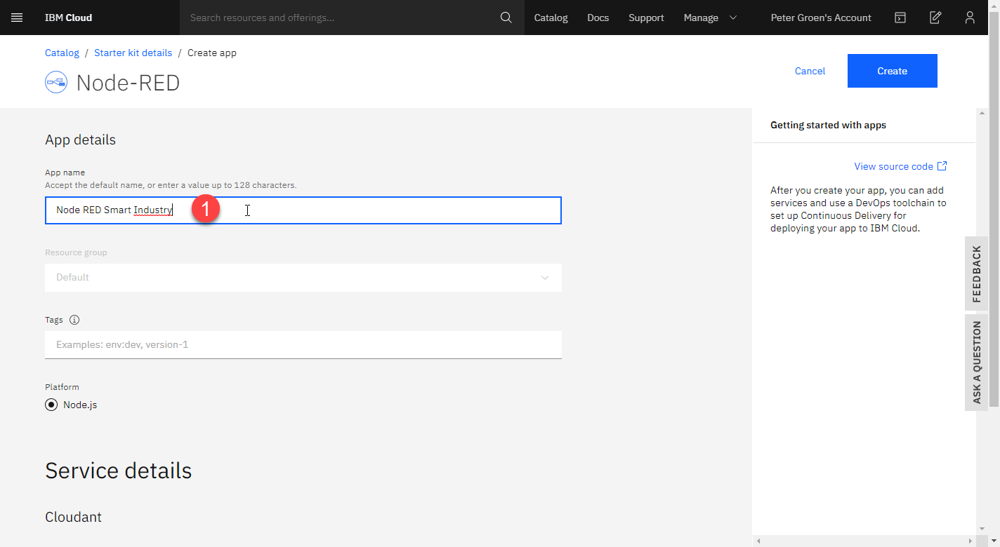

Bij de Service details geef je de dichtstbijzijnde locatie op, in dit geval `London`  en zorg je dat het `Lite` pakket geselecteerd staat bij het `Pricing plan`.

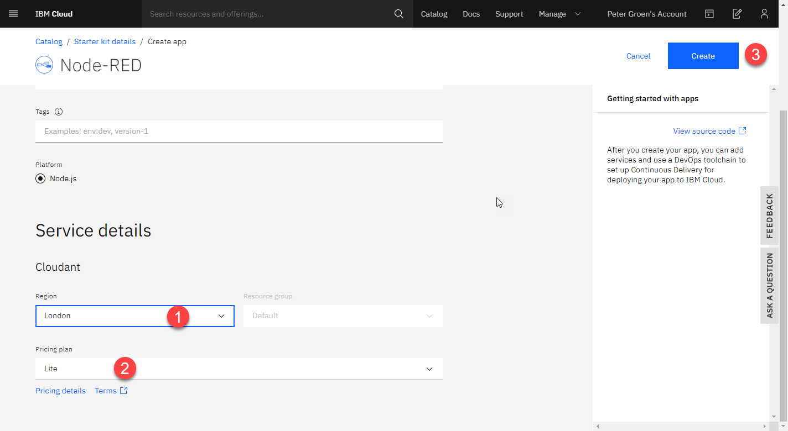

Nu kun je de app aanmaken via de knop `Create`. 

Het aanmaken en activeren van de app kan enkele minuten duren.

Als alles goed is gegaan krijg je onderstaand scherm te zien.

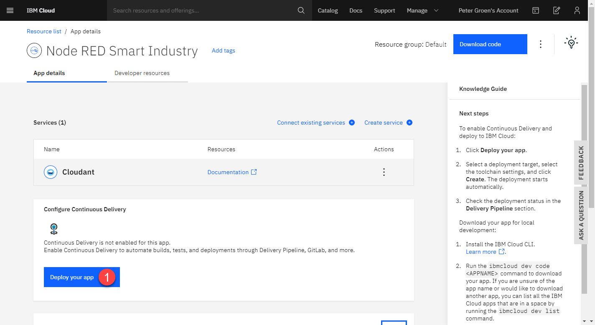

Hier druk je nu op `Deploy your app`

Hierna krijg je onderstaand scherm. Je moet nu eerst een `IBM Cloud API Key` maken. Dit doe je door op `New+` te klikken. En daarna op `OK`

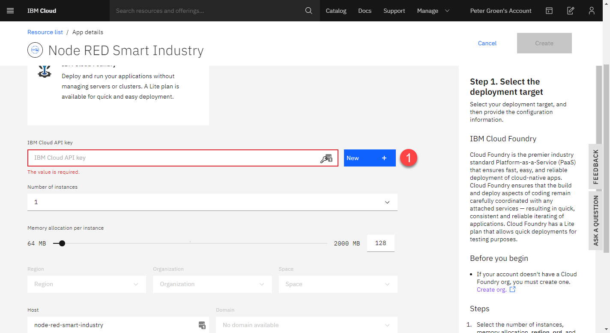

In het volgende scherm vul je de volgende gegevens in:

1. Verhoog het geheugen naar 256 MB anders loop je het risico dat je te weinig hebt.
2. Stel de `Region` van de app in op `London`. Een andere regio werkt momenteel niet.
3. De host naam moet uniek zijn en bepaald het voorste deel van de url van je app. Mocht deze al in gebruik zijn, dan krijg je een foutmelding en moet je hier een andere invullen.
4. De onderste `Region` maak je gelijk aan de regio bij `2`
5. Druk daarna op `Create` om deze app aan te maken.

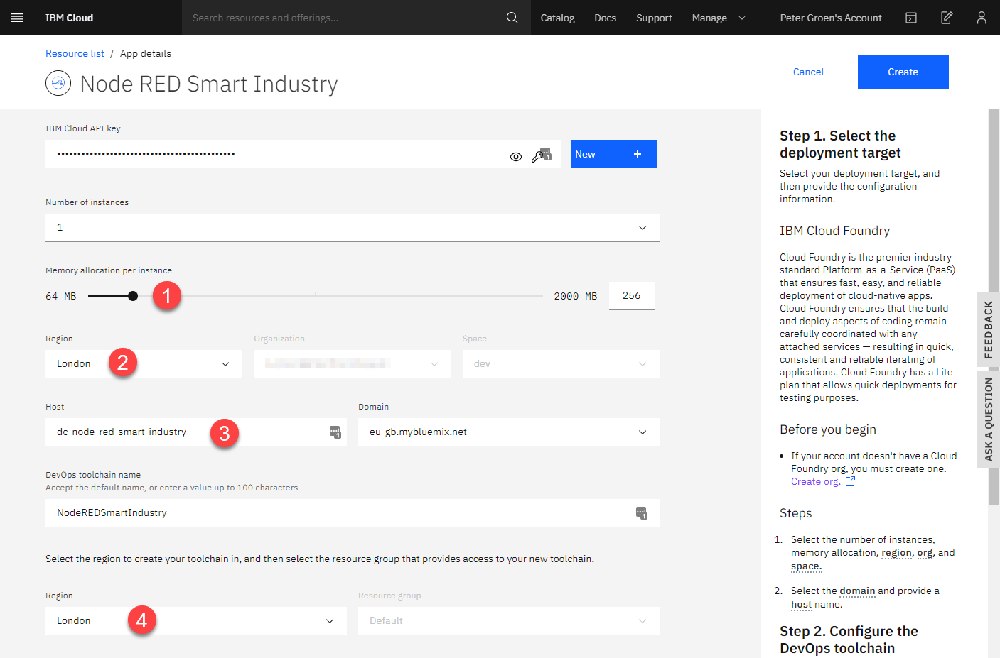

!!! info
	Het kan enkele minuten duren voordat de applicatie volledig is opgestart.
	Hierna is de Node-Red app nu klaar voor gebruik. 

## Open de Node-Red Applicatie

De Node-Red applicatie is nu actief en we kunnen de applicatie nu openen. Hiervoor hebben we de juiste url nodig om de applicatie te openen.

Ga hiervoor naar het dashboard en dan de resource list

 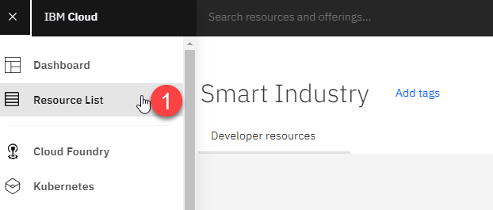

Open de `Cloud Foundry apps` en selecteer hier je eerder aangemaakte app.

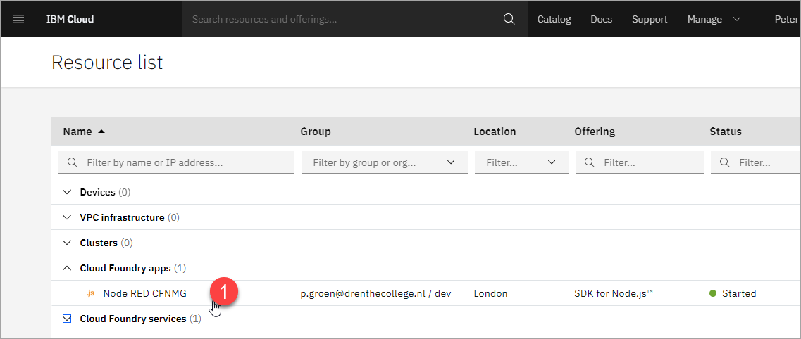

Je krijgt dan het volgende scherm

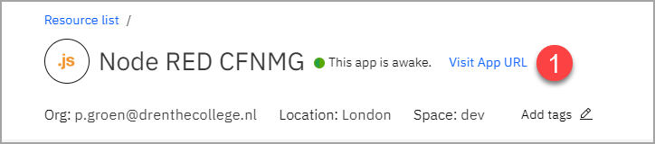

Klik hier op `Visit App URL`

!!! tip ""
	Er opent nu een nieuw scherm met jou nieuwe Node-Red app. Deze moet nu nog beveiligd worden, zodat niet iedereen er bij kan.

## Beveiligen van je Node-Red app

In je nieuwe app krijg je nu een aantal schermen te zien. Vul de gevraagde gegevens in zoals een zelf bedachte gebruikersnaam en bijbehorende wachtwoord.

!!! warning "Let Op!"
	Vul hier een andere gebruiker en wachtwoord in dan waarmee je inlogd op de IBM Cloud omgeving. Deze login wordt alleen gebruikt voor de beveiliging van de Node-Red app.

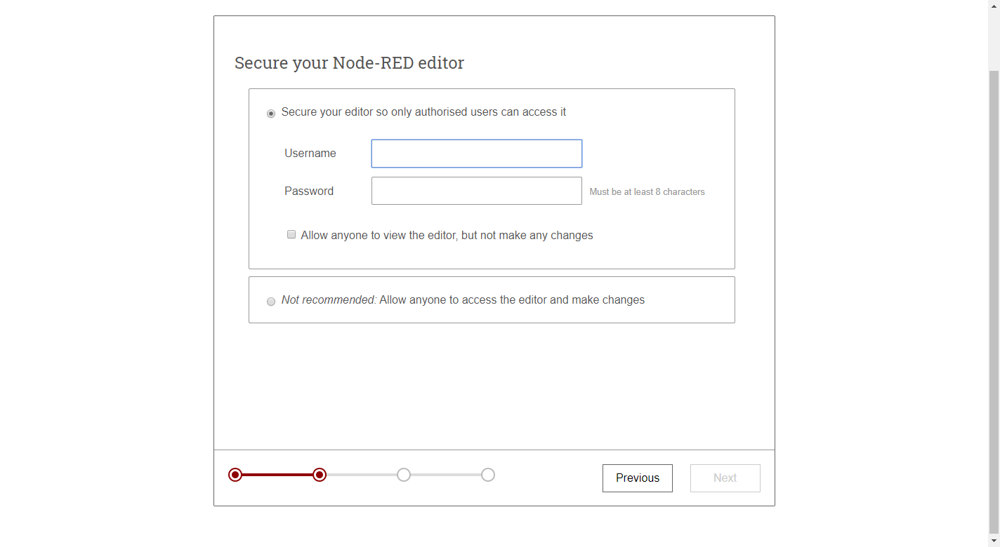

Na het laatste scherm wordt de app gestart en kun je naar de flow editor

Log nu in met de eerder opgegeven gebruiker en wachtwoord combinatie.

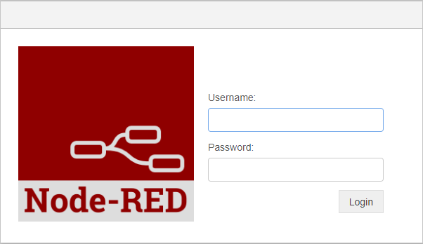

Je krijgt nu het start scherm van een nieuwe flow te zien.

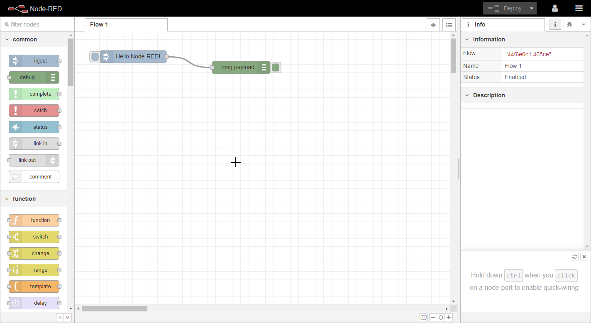

!!! tip "Hoofdstuk afgerond"
	Nu kun je verder met het volgende deel van deze handleiding namelijk het maken van een flow om dat van Buienradar zichtbaar te maken in een dashboard!

 	[Ga verder via deze link](weerstation.md)

