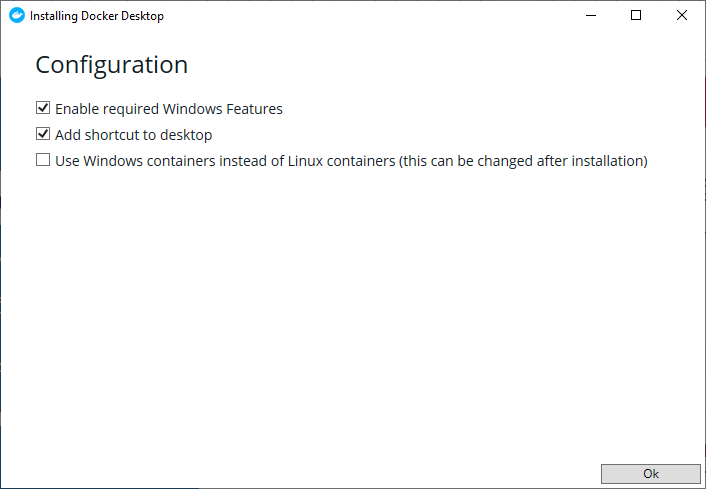
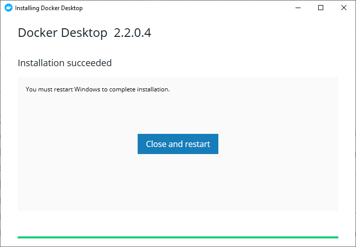
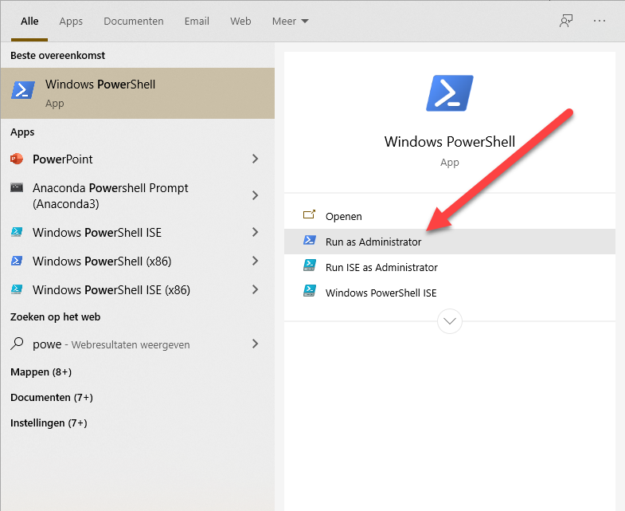

# Installatie

De installatie van Node-Red kan op twee manieren. Een lokale installatie op je PC en een installatie via Docker.

Voor deze workshop gebruiken we de Docker installatie. Hiermee heb je een installatie die je makkelijk kunt installeren en weinig tot geen resten op je systeem achter laat als je na de workshop alles weer wilt verwijderen. Alleen Docker installeer je dan op je systeem en dit is gemakkelijk weer te verwijderen.

Voor deze handleiding gaan we uit van een installatie op Windows 10. Maar de installatie kan voor het zelfde gemak op een Mac geïnstalleerd worden. De commando's zijn vrijwel gelijk.

## Docker installatie

Installeer als eerste Docker zelf.

Ga hiervoor naar [https://www.docker.com/]( https://www.docker.com/) en klik op "Get Started"

Selecteer hier voor welk systeem je Docker wilt installeren en klik op "Get Docker"

Als de download klaar is kun je het programma installeren.

Kies in het configuratie scherm voor de standaard opties.

Nadat de installatie klaar is moet de computer opnieuw worden opgestart. 

Mocht je nog documenten open hebben, dan ik het handig deze eerst op te slaan, voordat je de computer opnieuw opstart.

Na het opstarten is Docker klaar voor gebruik.

Als dit gelukt is kun je onderstaande instructies verder overslaan.

## Lokale installatie

Mocht je computer te weinig geheugen hebben om Docker te draaien dan kan een lokale installatie uitkomst bieden. De onderstaande instructies gaan uit van Windows. Heb je een anders besturingssysteem of bijvoorbeeld een Raspberry Pi, dan kun je de instructies van de Node-Red website gebruiken: 

[https://nodered.org/docs/getting-started/](https://nodered.org/docs/getting-started/)

Het is aan te bevelen om voor de commando's hieronder de Windows Power Shell te gebruiken. Je start deze als administrator door in het zoekveld van Windows (windows toets en dan beginnen te typen) Power Shell in te typen. Naast het menu krijg je nu de optie om "Power Shell" te starten als administrator. Dit geeft je wat meer rechten waardoor je de installatie commando's mag uitvoeren.

### Node.js installeren

Je kunt de laatste versie van node.js installeren van de officiele website van node.js, https://nodejs.org/en/. Kies op deze pagina voor de LTS versie. Dit is de meest stabiele versie en voldoende voor node-red.

LTS staat voor **L**ong **T**erm **S**upport.

Zorg dat je de installatie uitvoert met lokale administrator rechten. 

