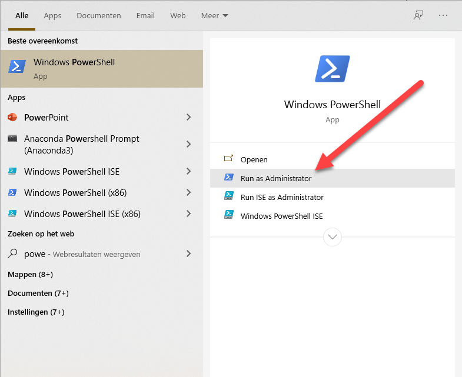

Als dit gelukt is kun je onderstaande instructies verder overslaan.

## Lokale installatie

Mocht je computer te weinig geheugen hebben om Docker te draaien dan kan een lokale installatie uitkomst bieden. De onderstaande instructies gaan uit van Windows. Heb je een anders besturingssysteem of bijvoorbeeld een Raspberry Pi, dan kun je de instructies van de Node-Red website gebruiken: 

[https://nodered.org/docs/getting-started/](https://nodered.org/docs/getting-started/)

Het is aan te bevelen om voor de commando's hieronder de Windows Power Shell te gebruiken. Je start deze als administrator door in het zoekveld van Windows (windows toets en dan beginnen te typen) Power Shell in te typen. Naast het menu krijg je nu de optie om "Power Shell" te starten als administrator. Dit geeft je wat meer rechten waardoor je de installatie commando's mag uitvoeren.

### Node.js installeren

Je kunt de laatste versie van node.js installeren van de officiele website van node.js, https://nodejs.org/en/. Kies op deze pagina voor de LTS versie. Dit is de meest stabiele versie en voldoende voor node-red.

LTS staat voor **L**ong **T**erm **S**upport.

Zorg dat je de installatie uitvoert met lokale administrator rechten. 