# Weerstation

In dit hoofdstuk gaan we een dashboard maken met de weerdata van Buien Radar. 

## Installatie van de extra blokken

Als je de voorgaande stappen goed hebt doorlopen moet je nu in het dashboard van Node-Red zitten en zie je onderstaand scherm met een blanco flow:

In Node-Red kun je doormiddel van bouwblokken verschillende functies aan elkaar knopen. Dit heet een `flow` en de eerste lege `flow` zie je hierboven.

De blokken links kun je in de flow slepen en daarna kun je hier weer andere functie aan vast maken.

Voordat we verder gaan, moeten we eerst nog wat extra installeren. Momenteel ontbreken namelijk de bouwblokken van Buienradar en ook de blokken van het dashboard zijn nog niet aan wezig.

Ga eerst naar de rechterbovenhoek van je scherm en klik daar op de drie horizontale lijnen  en daarna op `Manage pallet` 

Je krijgt nu het volgende scherm:

Ga naar het tabblad `Install` en vul daarna in het zoekveld de term `dashboard` in.

Je ziet nu de `node-red-dashboard`module in de lijst. Klik op `install` om de module te installeren.

Je moet vervolgens bevestigen dat je de module echt wilt installeren. Klik op `Install`

Nu we toch in dit scherm zitten, installeren we direct de Buienradar plugin. 

Doe dit op de zelfde manier. De Buien Radar plugin heet `node-red-contrib-buienradar`

Dit scherm kun je nu sluiten.

Als het goed is zijn de volgende blokken nu zichtbaar in de linker balk:

Nu zijn alle blokken goed geïnstalleerd en kunnen we onze eerste `flow` maken.

## Weerdata inlezen van Buienradar

Sleep nu het Buienradar block naar het raster in het midden van het scherm

Sleep nu een `debug block` naast het `Buienradar block` 

Zodra je het debug block neerzet zal dit veranderen in een `msg.payload block`

Zoals je ziet heeft het Buienradar Block aan beide zieden een klein grijs vlakje staan. Deze vierkanten zijn de connectoren van een block. Aan de linkerkant vindt je de ingangen, aan de rechterkant de uitgangen.

Deze vlakken kunnen worden gebruikt om twee of meerdere blokken aan elkaar te verbinden.

Maak nu de connectie tussen de uitgang van het `Buitenradar block` en de ingang van het `debug` of `msg.payload block`.

De blokken zijn nu verboden en je kunt nu het Buienradar block gaan instellen. Dubbelklik op het Buienradar block. Nu krijg je onderstaand configuratie scherm.

Verander het Station naar de dichtstbijzijnde locatie en set een interval om de hoeveel minuten je de data zou willen ophalen. Voor deze workshop is 1 keer per minuut voldoende. Klik daarna op `Done`.

## Je eerste Flow activeren

De flow die je nu hebt gemaakt is nog niet actief. Daarvoor moet je de server de opdracht geven om de huidige flow te activeren. Dit doe je door in de rechterbovenhoek op  te klikken.

De server zal de flow nu activeren en beginnen met de uitvoer.

Om te bekijken wat voor data het Buienradar block nu inleest en in welk formaat die aan de uitgangskant beschikbaar is, moeten we bekijken wat er in het debug block binnen komt. Alle input van de debug blokken in de flow komen binnen op de debug console. Je opent deze door op het `"bug"` symbool te drukken in de rechter bovenhoek .

Je krijgt nu alle debug berichten te zien. Klik op het pijltje om het bericht verder te bekijken.

Je krijgt nu alle info te zien die het Buienradar block heeft binnen gekregen.

Je selecteert temperatuurGC en kopieert het pad door op het `>_` icoon te drukken.

Hiermee kopieer je de link naar dit specifieke object.

We gaan nu zorgen dat deze data uit het gehele bericht wordt gefilterd. Dit doe je door een naar je flow te slepen onder het `debug block`. Ook dit block veranderd weer van naam naar `set.msg.payload`

Verbind de uitgang van Buienradar met dit nieuwe block. Je krijgt dan het onderstaande.

Door te dubbel klikken op dit nieuwe block krijg je de eigenschappen weer te zien.

Geef nu als naam op `Temperatuur` en verander het `to`: veld naar `msg.` en plak hier het eerder gekopieerde `path` van het debug scherm. Je plakt als het goed is nu de tekst: `payload.buienradar.temperatuurGC`

Als je nu een debug block achter het change blok zet, dan kun je in het debug venster zien of de temperatuur overeenkomt. 

Je krijgt dan de volgende flow

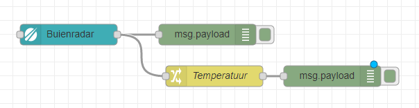

Als je weer op deploy drukt dan krijg je in het debug venster het volgende

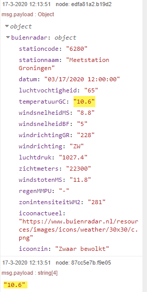

Als dit overeenkomt werkt het zoals bedoeld. Je kunt nu het debug blok achter de `change` functie verwijderen door het te selecteren en dan op `delete` te drukken

 Zo niet, dan zit er ergens nog iets fout. Loop dan de instructies nog even na. Wellicht heb je het verkeerde `path` geselecteerd vanuit de lijst met waardes in het debug venster. 

Nu is dit deel klaar.

We gaan nu een meter plaatsen voor het dashboard.

## Dashboard 

Bij de dashboard blokken heb je verschillende manieren om de data te visualiseren. We selecteren voor de temperatuur het 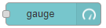blok

Sleep dit naast het temperatuur blok en verbind de twee.

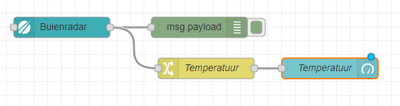

Je configureert het blok nu als volgt

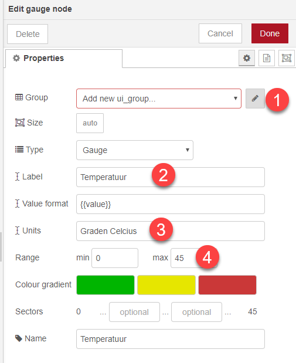

Als eerste moet je een `Group` toevoegen. Klik hiervoor op 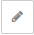achter het `Group` veld.

Je krijgt nu onderstaande dialoog

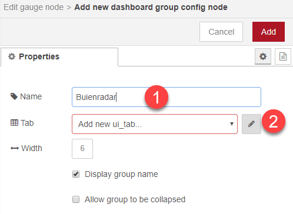

Geef hier een naam voor de `group` en maak ook een nieuw tabblad aan. Je krijgt dan het volgende scherm

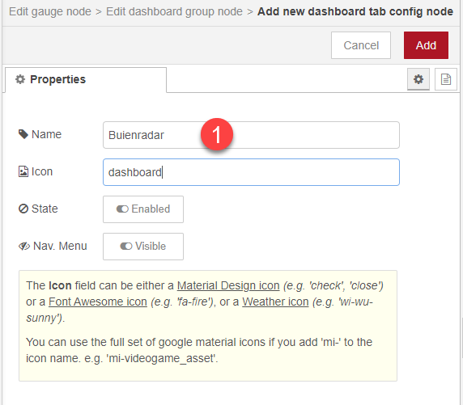

Druk hierna op `Add` om deze actie toe te voegen. 

Je komt hierna in het configuratie scherm van de `Gauge` 

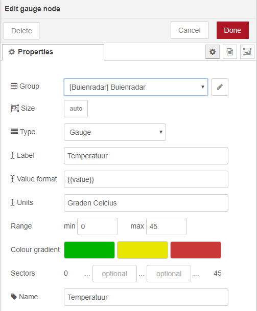

Vul de overige gegevens in zodat de juiste labels zichtbaar worden in je dashboard.

Klik hierna op `Done` en je komt weer in je flow scherm. Klik nu op `Deploy` zodat je flow actief wordt.

Als alles goed is gegaan en je hebt geen fouten, dan kun je het dashboard bereiken door rechtsboven in je scherm op het 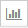icon te klikken. Mocht deze niet zichtbaar zijn dan kun je meer opties zichtbaar maken via het pijltje aan de zijkant.

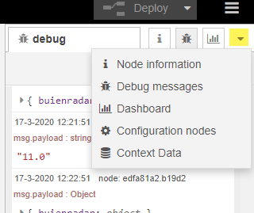

Je ziet nu het volgende scherm

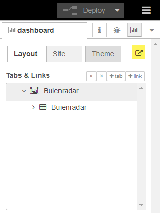

Je opent het dashboard nu door op het icoon naast de tabbladen te klikken 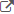

Je dashboard ziet er nu ongeveer zo uit:

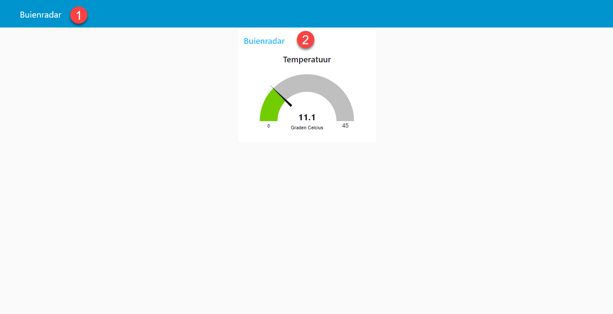

Zoals je ziet is er momenteel maar 1 tabblad `1`. Deze heeft de titel zoals eerder ingegeven. 
Ook zie je bij `2` een groep waar de meter van de temperatuur in zit. De labels zoals je die eerder hebt aangegeven zijn zichtbaar. Je kunt meerdere meters groeperen door middel van een `group` en verschillende soorten data op meerdere tabbladen zichtbaar maken.

## Luchtvochtigheid toevoegen

Probeer nu zelf de luchtvochtigheid toe te voegen op dezelfde manier als de temperatuur.

Je moet nu iets krijgen dat lijkt op onderstaande afbeelding.

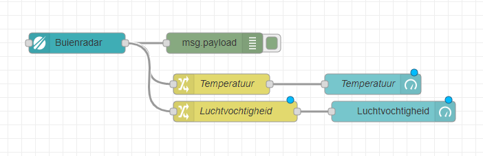

Na een `deploy` ziet je dashboard er zo uit:

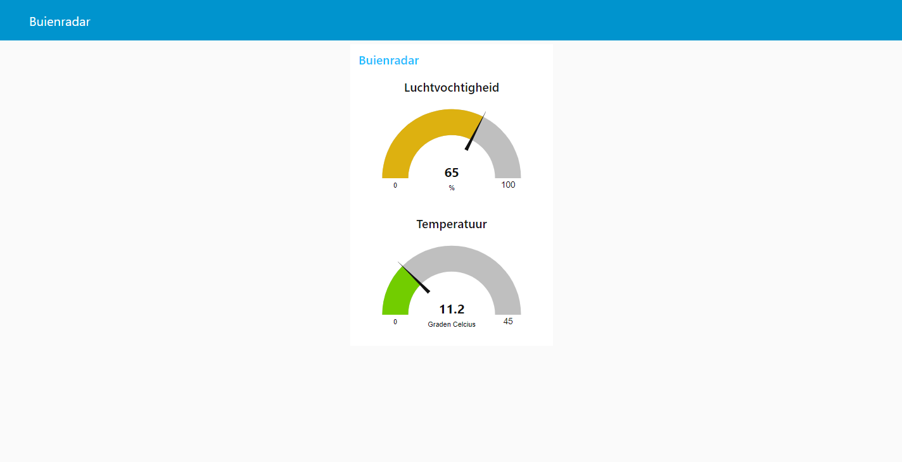

Je ziet dat zonder dat je je scherm ververst, het dashboard veranderd na een `deploy`. De weerdata wordt nu elke minuut ingelezen en automatisch ververst.

## Toevoegen weer tekst

Op de zelfde manier voeg je nu `icoonzin` data van buienradar toe aan een text block 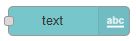

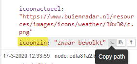

Je flow ziet er nu zo uit:

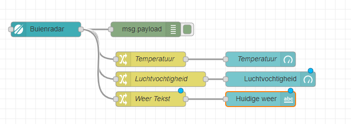

Je dashboard ziet er nu zo uit:

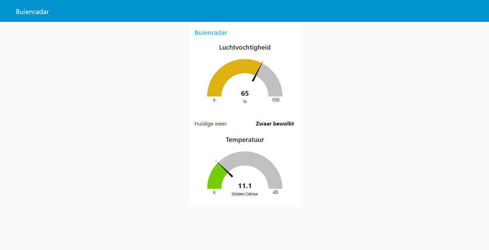

Zoals je ziet is de volgorde willekeurig en staat het tekst blok nu tussen de meters, wat de leesbaarheid niet vergroot.

We zullen nu de volgorde aanpassen. Ga naar het dashboard gedeelte aan de rechterkant en klap de data uit met de pijlen aan de linker kant van de labels.

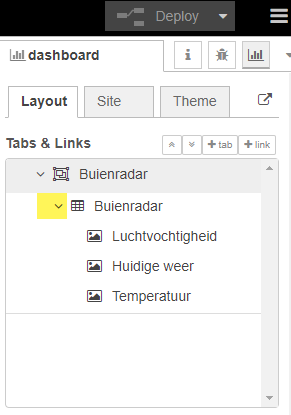

Door de volgorde te slepen kun je een iets logischere indeling maken

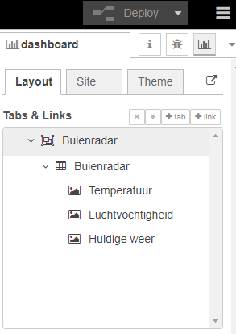

Je dashboard ziet er nu zo uit:

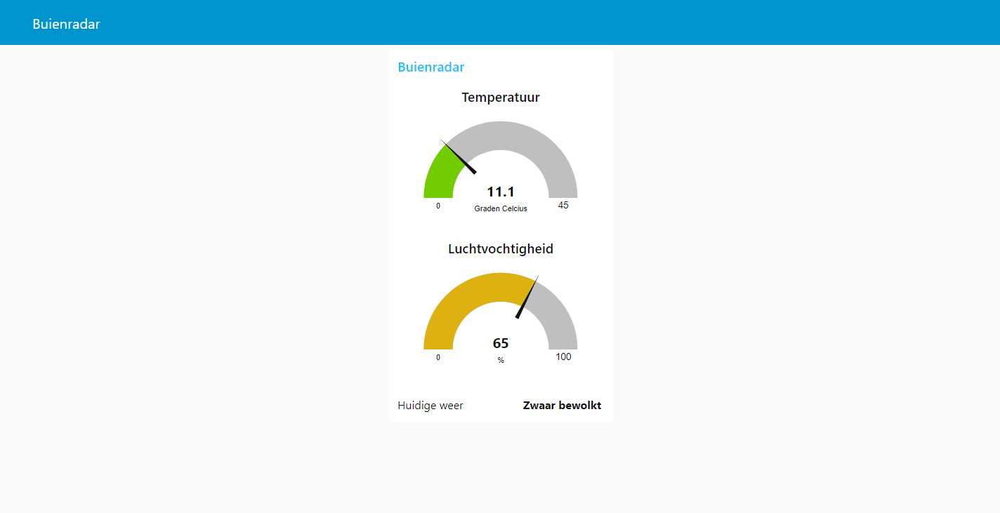 

------

## Weergave veranderen

Je kunt ook spelen met het type meter dat op je dashboard staat. Via de instellingen van dekun je deze naar bijvoorbeeld een donut zetten. Hiermee krijg je een ander uiterlijk.

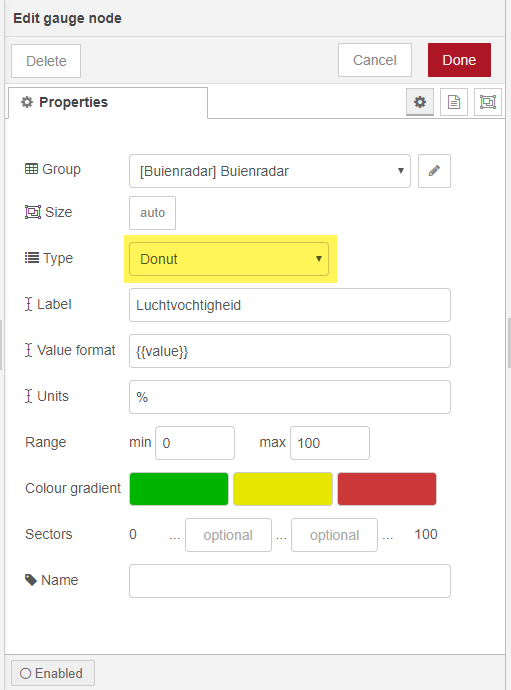

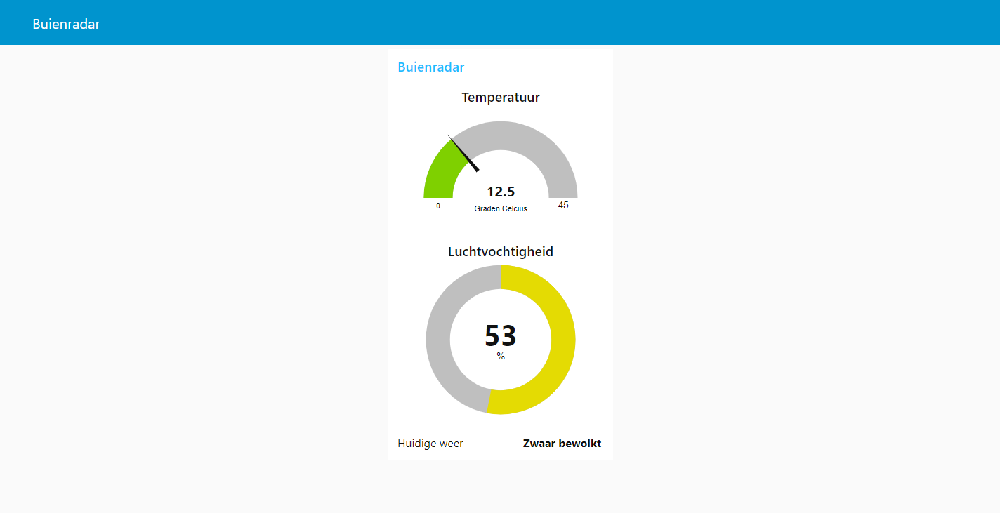

## Extra

Voel je vrij om ook de andere data van Buienradar toe te voegen. Je kunt zelf kiezen in welke vorm dit het beste tot zijn recht komt. Probeer te spelen met meerdere groepen op het dashboard en verschillende soorten meters. Zoek op [wikipedia](https://nl.wikipedia.org/) op wat de meet bereiken zijn van de verschillende waardes. Zo kan een meter bijvoorbeeld ook op een andere waarde beginnen dan op 0 zoals bijvoorbeeld bij de luchtdruk deze zal altijd een minimale waarde hebben en ook nooit boven een bepaalde waarde uitkomen. 
De temperatuur in ditvoorbeeld begint bijvoorbeeld op 0 maar het kan natuurlijk ook vriezen.

Een voorbeeld vindt je hieronder.

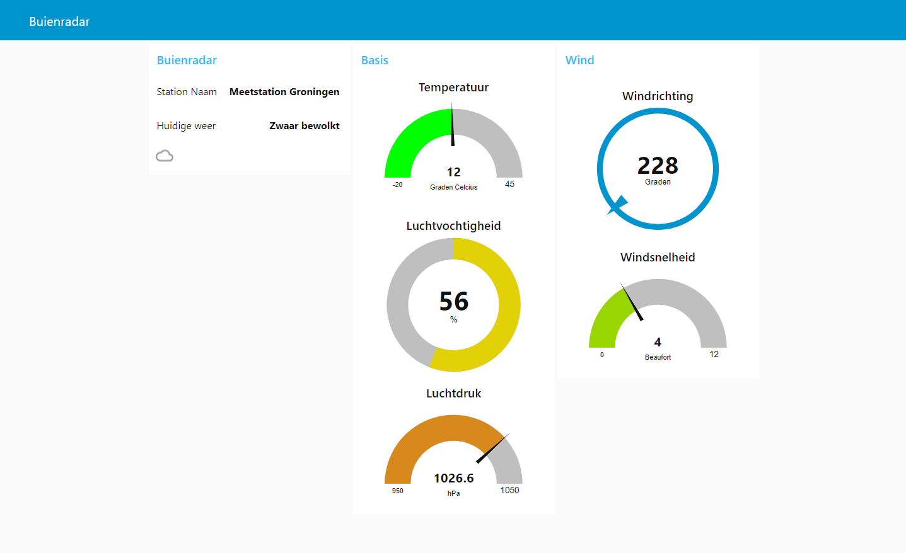