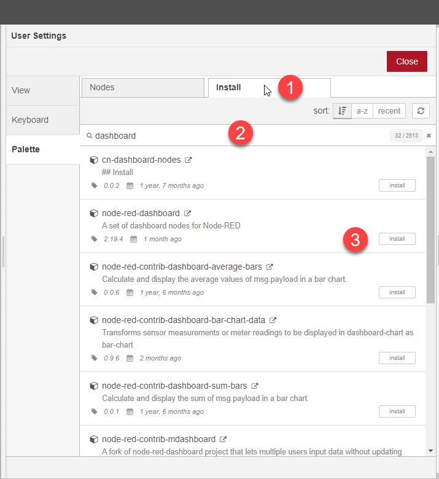

# Weerstation

In dit hoofdstuk gaan we een dashboard maken met de weerdata van Buien Radar. 

## Installatie van de extra blokken

Als je de voorgaande stappen goed hebt doorlopen moet je nu in het dashboard van Node-Red zitten en zie je onderstaand scherm met een blanco flow:

In Node-Red kun je doormiddel van bouwblokken verschillende functies aan elkeer knopen. Dit heet een `flow` en de eerste lege `flow` zie je hierboven.

De blokken links kun je in de flow slepen en daarna kun je hier weer andere functie aan vast maken.

Voordat we verder gaan, moeten we eerst nog wat extra installeren. Momenteel ontbreken namelijk de bouwblokken van Buienradar en ook de blokken van het dashboard zijn nog niet aan wezig.

Ga eerst naar de rechterbovenhoek van je scherm en klik daar op de drie horizontale lijnen  en daarna op `Manage pallet` 

Je krijgt nu het volgende scherm:

Ga naar het tabblad `Install` en vul daarna in het zoekveld de term `dashboard` in.

Je ziet nu de `node-red-dashboard`module in de lijst. Klik op `install` om de module te installeren.

Je moet vervolgens bevestigen dat je de module echt wilt installeren. Klik op `Install`

Nu we toch in dit schrem zitten, installeren we direct de Buienradar plugin. 

Doe dit op de zelfde manier. De Buien Radar plugin heet `node-red-contrib-buienradar`

Dit scherm kun je nu sluiten.

Als het goed is zijn de volgende blokken nu zichtbaar in de linkerbalk:

Nu zijn alle blokken goed geinstalleerd en kunnen we onze eerste `flow` maken.

## Weerdata inlezen van Buienradar

Sleep nu het Buienradar block naar het raster in het midden van het scherm

Sleep nu een `debug block` naast het `Buienradar block` 

Zodra je het debug block neerzet zal dit veranderen in een `msg.payload block`

Zoals je ziet heeft het Buienradar Block aan beide zieden een klein grijs vlakje staan. Deze viekanten zijn de connectoren van een block. Aan de linkerkant vindt je de ingangen, aan de rechtekant de uitgangen.

Deze vlakken kunnen worden gebruikt om twee of meerdere blokken aan elkaar te verbinden.

Maak nu de connectie tussen de uitgang van het `Buitenradar block` en de ingang van het `debug` of `msg.payload block`.

De blokken zijn nu verboden en je kunt nu het Buienradar block gaan instellen. Dubbelklik op het Buienradar block. Nu krijg je onderstaand configuratie scherm.

Verander het Station naar de dischtsbijzijnde locatie en set een interval om de hoeveel minuten je de data zou willen ophalen. Voor deze workshop is 1 keer per minuut voldoende. Klik daarna op `Done`.

## Je eerste Flow activeren

De flow die je nu hebt gemaakt is nog niet actief. Daarvoor moet je de server de opdracht geven om de huidige flow te activeren. Dit doe je door in de rechterbovenhoek op  te klikken.

De server zal de flow nu activeren en beginnen met de uitvoer.

Om te bekijken wat voor data het Buienradar block nu inleest en in welk formaat die aan de uitgangs kant beschikbaar is, moeten we bekijken wat er in het debug block binnen komt. Alle input van de debug blokken in de flow komen binnen op de debug console. Je opent deze door op het `"bug"` symbool te drukken in de rechter bovenhoek .

Je krijgt nu alle debug berichten te zien. Klik op het pijltje om het bericht verder te bekijken.

Je krijgt nu alle info te zien die het Buienradar block heeft binnen gekregen.

Je selecteerd temperatuurGC en kopieerd het pad door op het `>_` icoon te drukken.

Hiermee kopieer je de link naar dit specifieke object.

We gaan nu zorgen dat deze data uit het gehele bericht wordt gefilterd. Dit doe je door een naar je flow te slepen onder het `debug block`. Ook dit block veranderd weer van naam naar `set.msg.payload`

Verbind de uitgang van Buienradar met dit nieuwe block. Je krijgt dan het onderstaande.

Door te dubbel klikken op dit nieuwe block krijg je de eigenschappen weer te zien.

Geef nu als naam op `Temperatuur` en verander het to: veld naar `msg.` en plak hier het eerder gekopieerde path van het debug scherm. Je plakt als het goed is nu de tekst: `payload.buienradar.temperatuurGC`

Nu is dit deel klaar.

We gaan nu een meter plaatsen voor het dashboard.

## DashBoard